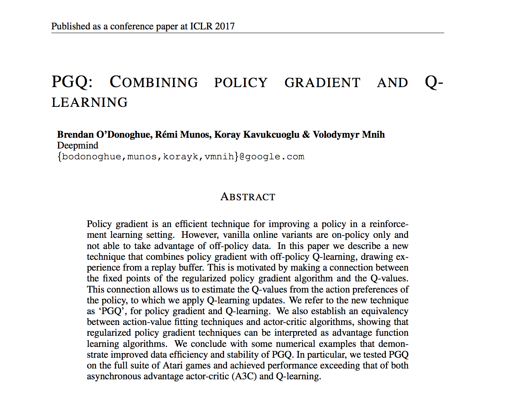
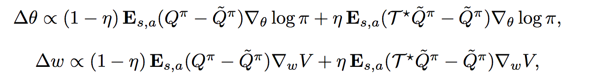
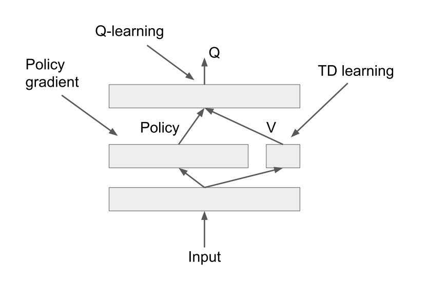
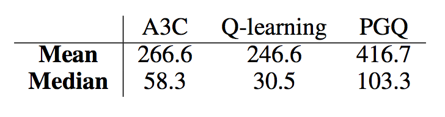
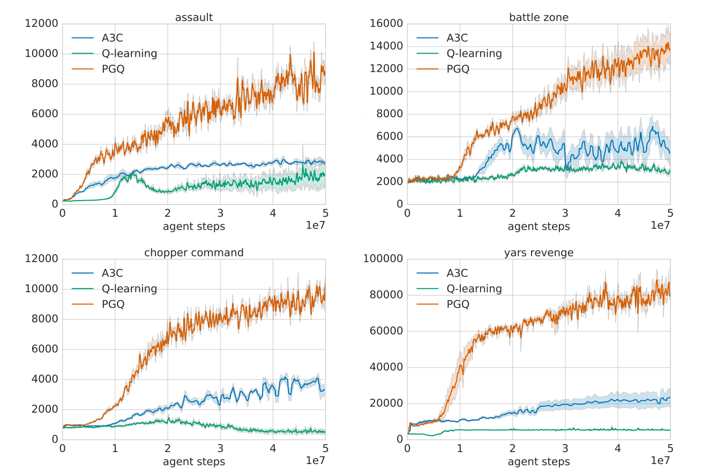
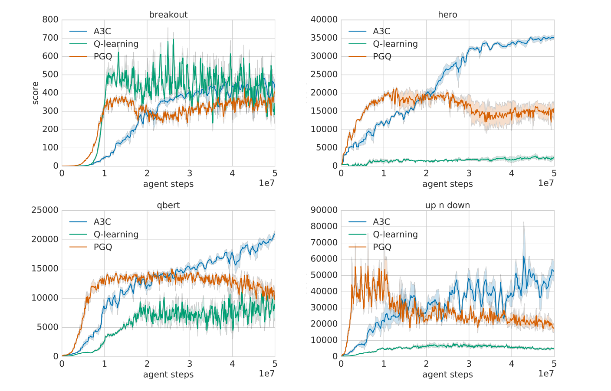

class: center, middle

#### 【論文紹介】
### Bridging the Gap Between Value and Policy Based Reinforcement Learning
#### Nachum et al. 2017

Sotetsu KOYAMADA (@sotetsuk)

---

### Table of Contents

- 論文概要

---

# 以下PGQのコピー

---

### Table of Contents

- 論文概要
- 強化学習の問題設定と定義
- Q学習と方策勾配法のReview
- 論文の理論的結果 (1)
- 論文の理論的結果 (2)
- 提案手法の説明: PGQ
- 実験結果
- 参考文献

---

## 論文概要

---

---

### 紹介する理由

##### 1. 強化学習における二つの別々の主要なアプローチの統合を試みている
- 理論的に興味深い
- 実用面からも長所を組み合わせることが期待できる

##### 2. Atariベンチマークでの強い実験結果

---

### ICLR2017レビュアーのコメント

https://openreview.net/forum?id=B1kJ6H9ex

>  It has the potential to be an impactful paper, with the most positive comment noting that it **"will likely influence a broad swath of RL"**.

---

### TL;DR (1)

##### 理論的貢献 (1)
エントロピー正則化付きの方策勾配法の停留点において、方策とアドバンテージ関数（Q関数）の間に次式の関係性を示し、**この関係から方策勾配法において明示的に推定しなくても適切な行動価値関数を導出できる。**

##### 理論的貢献 (2)
エントロピー正則化付きのActor-critic法と行動価値を推定する手法 (Q学習やSARSA) は更新則が等しくなる（特別な場合）。とくに、Actor-critc法をAdvantage function learningと見なすことが出来る。

---

### TL;DR (3)

##### PGQの提案と評価
理論的貢献(1)の結果から得られる行動価値関数をベルマン最適方程式を満たすように正則化をかけたアルゴリズムPGQを提案。**これは `\( \eta =0 \)` のときはエントロピー正則化付きの方策勾配法、`\( \eta = 1\)` のときは特殊な構造のQ学習をしていると捉えられる。**AtariドメインでMedianでも人を上回り、DQNやA3Cと比べても一人負けするゲームが存在しないという安定性を見せた。

---

## 強化学習の問題設定と定義

---

### 一般的な強化学習の問題設定 (1)

#### マルコフ決定過程 (MDP)

.green[**環境**] は現在の **状態** と **行動** にだけ依存して未知の **状態遷移確率** `\(P\)` から次の **状態** と **即時報酬** を返す

`$$(X_{t+1}, R_{t+1}) \sim P( \cdot \,|\, X_t, A_t)$$`

.green[**エージェント**] は現在の **状態** と **報酬** を観測し、現在の **方策** `\(\pi\)` に基づいて次の **行動** を返す

`$$A_{t} \sim \pi(\cdot \,|\, X_t)$$`

サンプル系列 `\(\left(X_0, A_0, R_1, X_1, A_1, \ldots \right)\)` が生成される

---

### 一般的な強化学習の問題設定 (2)

#### コントロール

.green[**目的関数**] `\(J\)` を最適化するように方策を学習する（例: 割引報酬和の期待値）

`$$J(\pi) = \mathbf{E} \left[\sum_{t=1}^{\infty} \gamma^{t} R_{t+1} \right]$$`

---

### ある方策に基づく価値関数

**Def.** 行動価値関数 （期待値は状態遷移確率と方策 `\(\pi\)`）

`$$Q^{\pi}(x, a) := \mathbf{E} \left[\sum_{t=0}^{\infty} \gamma^{t} R_{t+1} \,|\, X_0 = x, A_0 = a \right]$$`

**Def.** 方策 `\(\pi\)` に基づくベルマン作用素

`$$T^{\pi}Q(x, a) = r(x, a) + \gamma \sum_{x^{\prime}, a^{\prime}} \pi(a^{\prime}|x^{\prime}) P(x^{\prime}|x, a) Q(x^{\prime}, a^{\prime})$$`

（ただし、`\(r(x, a) = \mathbf{E} \left[R_{t+1} | X_t=x, A_t=a\right] \)` ）

この行動価値関数 `\(Q^{\pi}\)` は、ベルマン作用素の不動点 (i.e., `\(T^{\pi}Q=Q\)` ) として求まる（める）

---

### 最適行動価値

理想的な行動を取ったとすると、最適化したい指標が期待的にどうなるか

**Def.** 最適行動価値関数

`$$Q^{\ast}(x, a) := \max_{\pi} Q^{\pi} (x, a) $$`

**Def.** ベルマン最適作用素

`$$T^{\ast}Q(x, a) := r(x, a) + \gamma \sum_{x^{\prime}} P(x^{\prime}|x, a) \max_{a^{\prime}} Q(x^{\prime}, a^{\prime})$$`

最適行動価値関数 `\(Q^{\ast}\)` は、ベルマン最適作用素の不動点 (i.e., `\(T^{\ast}Q=Q\)` ) として求まる（める）

---

### 強化学習（コントロール）の二系統

#### 価値ベース

- （行動）価値関数を直接推定・最適化する
- **Q学習** [Watkins89] **SARSA** [Rummery&Niranjan94]
- w/ 深層学習: .red[**DQN**] [Mnih+13, 15]

#### 方策ベース

- 方策を直接推定・最適化する
- **方策勾配法** [Sutton+99]
- w/ 深層学習: .red[**A3C**] [Mnih+16]

---

## Q学習, SARSA, 方策勾配法のReview

---

### SARSA, Q学習

SARSAは現在の方策に基づく行動価値関数を、Q学習は最適行動価値関数をパラメトライズしてベルマン作用素の不動点を求めるよう更新する:

`$$\nabla_{\theta}\left( T^{\pi}Q_{\theta} - Q_{\theta} \right) = \mathbf{E} \left[ \left( T^{\pi}Q_{\theta} - Q_{\theta} \right) \nabla_{\theta}Q_{\theta} \right]\\
\nabla_{\theta}\left( T^{\ast}Q_{\theta} - Q_{\theta} \right) = \mathbf{E} \left[ \left( T^{\ast}Q_{\theta} - Q_{\theta} \right) \nabla_{\theta}Q_{\theta} \right]$$`

- サンプリングは現在の `\(Q_{\theta}\)` に基づいた `\(\epsilon\)`-グリーディ方策かボルツマン方策が用いられることが多い
- ターゲットが現在の推定している `\(Q_{\theta}\)` に依存しているのでブートストラップになっている（TD法全般に共通）
- それぞれ適切な条件下で最適行動価値関数へ収束する（SARSAは **方策改善** も必要とする (e.g., GLIEを満たす方策を用いる[Singh+00])）

---

### 方策勾配法

方策 `\(\pi\)` をパラメトライズした上で `\(\pi_{\theta}\)` を直接最適化する

`$$\nabla_{\theta} J(\theta) = \mathbf{E} \left[ Q^{\pi}(x, a) \nabla_{\theta} \log \left(\pi(a|x) \right) \right]$$`

- 方策勾配定理 [Sutton+99]
- `\(\pi\)` **からサンプルを生成してサンプル平均を取れば** 不偏推定量が計算できるので、それを使って更新を行なう
- 逆に `\(\pi\)` のような推定している分布に関するサンプリングが必要なような確率的最適化の場面では強化学習以外の文脈でも使われる (e.g., hard attention [Mnih+14, Xu+15] , sequence generatioon [Ranzato+16, Bahdanau+17])

---

### 方策勾配法

`\(Q^{\pi}\)` は現実的には他のものが使われる
- 実際の即時報酬 `\(R\)`（REINFORCE[Williams+92]）
- 実際の報酬の複数ステップ先読み版

また、推定量の分散を抑えるため、`\(a\)` と関係のないベースライン `\(b\)` が上記の最適化するものから引かれる。bの例としては

- `\( V^{\pi}(x) \)`

現実的には複数ステップ先読みした（推定）収益と、ベースライン`\(V^{\pi}\)`を使われ[Mnih+16]、方策と価値関数を推定するのでActor-critic法になる

---

### 方策勾配法におけるエントロピー正則化

- 方策勾配法の問題点として探索と活用のトレードオフを特に考慮してない点がある
- 方策に関するエントロピー正則化項を加えて方策が決定論的にならないよう正則化するのは一般的 [Williams&Peng91]

この観点からのより興味深い分析が、ごく最近arXivに投稿されている [Nachum+17]

---

### Q学習と方策勾配法の特徴

この研究のモチベーションを理解するため、Q学習と方策勾配法の特徴とPros/Consを説明する。

- .green[**Q学習**]: 本質的に **方策オフ型学習**（後述）の手法
- .green[**方策勾配法**]: 本質的に **方策オン型学習**（後述）の手法

**方策オフ・オン型アルゴリズムの性質由来のPros/Consが存在（後述）**

> ... Q-learning is an inherently off-policy algorithm ... [Szepesvari10]

---

### 方策オンと方策オフ

現在推定している方策（推定方策）と、実際に行動を選択肢、サンプルを生成している方策（行動方策）が等しい場合は **方策オン型** といい、そうでない場合は **方策オフ型** という。

---

### Q学習は本質的に方策オフ型

**Review:** Q学習の更新則

`$$\Delta_{\theta} \propto \nabla_{\theta}\left( T^{\ast}Q_{\theta} - Q_{\theta} \right) = \mathbf{E} \left[ \left( T^{\ast}Q_{\theta} - Q_{\theta} \right) \nabla_{\theta}Q_{\theta} \right]$$`

`$$T^{\ast}Q(x, a) := r(x, a) + \gamma \sum_{x^{\prime}} P(x^{\prime}|x, a) \max_{a^{\prime}} Q(x^{\prime}, a^{\prime})$$`

- **更新則の期待値のサンプル平均が推定方策に依存していないため、
.red[関係無い分布からサンプリングをしてもサンプル平均が不偏推定量になる]**
- 逆に、現在の `\(Q_{\theta}\)` に基づく最適方策 `\(\text{argmax}_{a} Q_{\theta} (x, a) \)` のサンプルだけから学習するのは不可能（`\(Q_{\theta}\)` の `\(\epsilon\)`-グリーディ方策やボルツマン方策など探索的行動も取らなければ任意の状態・行動に対し十分なサンプルが得られない）

---

### Q学習のPros/Cons
- **Pros:** **経験再生** [Lin92] を使えるのでデータ効率的
- **Pros:** 任意の方策からサンプリングされたデータで学習可能（サンプルサイズが十分あれば）
- **Cons:** .red[**複数ステップ法への拡張が難しい**]（サンプル平均がサンプリングする方策に依存するようになるのでバイアスが生じる）

##### このConsを解決するアプローチ

- **Importance sampling (IS)** [Precup+00] 推定方策と行動方策の分布比に応じて重み付け
- **Retrace(λ)** [Munos+16] ISの分散爆発を避けつつ長く先読みできるよう工夫
- **PCL** [Nachum+17] 本論文を踏まえた発展

---

### 方策勾配法は本質的に方策オン型

**Review:** 方策勾配法の更新則

`$$\Delta_{\theta} \propto \nabla_{\theta} J(\theta) = \mathbf{E} \left[ Q^{\pi}(x, a) \nabla_{\theta} \log \left(\pi(a|x) \right) \right]$$`

**この期待値は推定方策に依存しているためサンプル平均が、.red[方策オンでサンプリングされていないと不偏推定量になってくれない]**

---

### 方策勾配法のPros/Cons

- **Pros:** サンプル平均が行動方策に依存する場合でもバイアスがない
- **Pros:** 複数ステップ法が使えるのでバイアス・バリアンスのトレードオフがとれる
- **Cons:** .red[**経験再生と相性が悪くサンプルが使い捨てになりデータ効率が良くない**]
- **Cons:** **探索・活用のトレードオフを考慮してない**

##### このConsを解決しようとするアプローチ

- **ACER** [Wang+17]
- .red[**PGQ**] [O’Donoghue+17]

---

## この論文の理論的な貢献

---

### 理論的貢献(1)

##### .red[エントロピー正則化付きの方策勾配法の停留点において、方策とアドバンテージ関数の間に次式の関係性を示した（式4）]

`$$\pi(a|x) \propto \exp \left( A^{\pi}(x, a) / \alpha \right)$$`

この関係から逆に停留点での方策を使ってアドバンテージ関数とQ関数を `\( \tilde{A}^{\pi} \)`、`\( \tilde{Q}^{\pi} \)` と表すことができ、
方策勾配法でもQ関数の推定をしているとみなすことが出来るようになった（式6）。

`$$\Delta\theta \propto \mathbf{E} \left[ \left( Q^{\pi}(x, a) - \tilde{Q}^{\pi}(x, a) \right) \nabla_{\theta} \log \pi (x, a) \right]\\
$$`

PGQではこのQ関数にベルマン最適方程式を満たすよう正則化をかけている。
**また、この貢献は `\(\pi\)` と `\(V^{\pi}\)` から `\(Q^{\pi}\)` を表せていることになり、非自明**

---

### 理論的貢献(2)

**SARSA, Q学習の更新則**
`$$\nabla_{\theta}\left( T^{\pi}Q_{\theta} - Q_{\theta} \right) = \mathbf{E} \left[ \left( T^{\pi}Q_{\theta} - Q_{\theta} \right) \nabla_{\theta}Q_{\theta} \right]\\
\nabla_{\theta}\left( T^{\ast}Q_{\theta} - Q_{\theta} \right) = \mathbf{E} \left[ \left( T^{\ast}Q_{\theta} - Q_{\theta} \right) \nabla_{\theta}Q_{\theta} \right]$$`
**エントロピー正則化付き方策勾配法の更新則**
`$$\Delta\theta \propto \mathbf{E} \left[ \left( Q^{\pi}(x, a) - \tilde{Q}^{\pi}(x, a) \right) \nabla_{\theta} \log \pi (x, a) \right]\\
$$`
が似てる気がする... .green[**一緒では？**]

##### .red[Actor-critic法と行動価値を推定する手法 (Q学習やSARSA) は更新則が（特別な場合に）等しくなる。とくに、Actor-critc法をAdvantage function learningと見なすことが出来る]

---

### 理論的貢献(2)

##### 仮定一覧
- **引き続きエントロピー正則化は仮定として必要**
- Actor-criticの方策は `\( \pi(a|x) \propto \exp (W(x, a)) \)` の形で書ける
- 行動価値の学習ではDueling architecture[Wang+16]を用いる

##### 最小化する誤差の選び方の例
SARSAの場合もQ学習の場合も、現在の方策から求まるQ関数でターゲットをブートストラップすれば良い

---

## アルゴリズム

---

### 提案アルゴリズム: PGQ

PGQでは今までの議論からエントロピー正則化によって `\( \pi \)` から導かれるQ関数 `\( \tilde{Q}^{\pi} \)` にベルマン最適方程式を満たすよう正則化をかけている（式12, 14）

- 各更新則の前項は通常のエントロピー付きの方策勾配法に対応し、後項は新たに追加したベルマン最適方程式による正則化である。
- `\( \eta = 0 \)` でで通常のエントロピー付きの方策勾配法と見なすことができ、逆に `\( \eta = 0 \)` で（特殊な）Q学習と見なすことができる（Dueling architecture[Wang+16]に似ている）

---

### 経験再生を使った実際の更新則

現実的には式14のアップデートを同時にバッチで行なわない（方策勾配法を活かせない）

- 方策オンでサンプルを並列で生成し、方策勾配法により方策と価値関数を更新する
- 上記で観測されたサンプル系列はリプレイバッファへと貯められる
- 別プロセスがリプレイバッファに貯まったサンプルをバッチで、ベルマン最適方程式を満たすよう更新する

---

### アーキテクチャ

Dueling architecture[Wang+16]にかなり似てる

[O’Donoghue+17]より引用

---

## 実験

---

### Atariにおける性能評価

- DQN, A3Cと人のスコアを100で正規化したスコア
- 人のスコアにMedianでも勝利

[O’Donoghue+17]より引用

---

### PGQが上手くいってる例

[O’Donoghue+17]より引用

---

### PGQが上手くいかなかった例
**とはいえ、最下位にはなっていない**

[O’Donoghue+17]より引用

---

### 感想

- 方策勾配法が一ミリも探索・活用のトレードオフを考慮しないのは理論的な側面からいっても不自然な気がする（Q学習もSARSAも最適行動価値へ収束するためには十分な探索が条件になってる）ので、そういう意味では実はエントロピー正則化付きの目的関数を考えた方が逆に自然ということはさもありなんと言う気もする（この観点からは[Nachum+17]がさらに研究を進めている）
- アルゴリズム（PGQ）の提案が急に雑な気がする。要するに通常のエントロピー正則化付き方策勾配法で推定している方策と状態の価値関数から適当にQ関数を作ってそれにベルマン最適方程式で正則化をかけただけに見えてしまう
- とはいえ、AtariにおいてMedianでも初めて（？）人間レベルを上回った意義は大きいように思える

---

## 参考文献（年代順）

---

- [Watkins89] Learning from delayed rewards. PhD thesis 1989
- [Williams&Peng91] Function Optimization Using Connectionist Reinforcement Learning Algorithms. Connection Science 1991
- [Williams+92] Simple statistical gradient-following algorithms for connectionist reinforcement learning Machine Learning 1992.
- [Lin92] Self-Improving Reactive Agents Based On Reinforcement Learning, Planning and Teaching. Machine Leanring
- [Sutton+99] Policy Gradient Methods for Reinforcement Learning with Function Approximation. NIPS 1999

---

- [Rummery&Niranjan94] On-line Q-learning using connectionist systems. 1994
- [Singh+00] Convergence Results for Single-Step On-Policy Reinforcement-Learning Algorithms. Machine Learning 2000
- [Precup+00] Eligibility Traces for Off-Policy Policy Evaluation. ICML 2000
- [Szepesvari10] Algorithms for Reinforcement Learning. 2010
- [Mnih+13] Playing atari with deep reinforcement learning. NIPS-WS 2013

---

- [Mnih+14] Recurrent Models of Visual Attention. NIPS 2014
- [Mnih+15] Human-level control through deep reinforcement learning. Nature 2015
- [Xu+15] Show, attend and tell: Neural image caption generation with visual attention ICML 2015
- [Mnih+16] Asynchronous Methods for Deep Reinforcement Learning ICML 2016
- [Ranzato+16] Sequence level training with recurrent neural networks ICLR 2016

---

- [Wang+16] Dueling Network Architectures for Deep Reinforcement Learning ICML 2016
- [Bahdanau+17] An Actor-Critic Algorithm for Sequence Prediction. ICLR 2017
- [Munos+16] Safe and efficient off-policy reinforcement learning. NIPS 2016
- [Wang+17] Sample Efficient Actor-Critic with Experience Replay. ICLR 2017
- [O’Donoghue+17] PGQ: Combining Policy Gradient and Q-learning. ICLR 2017

---

- [Nachum+17] Bridging the Gap Between Value and Policy Based Reinforcement Learning. submitted to ICML 2017
