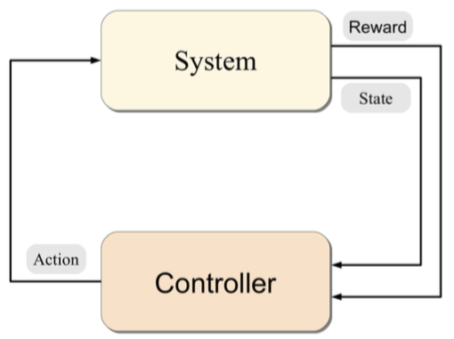

class: center, middle

# 強化学習勉強会まとめ

@sotetsuk

---

# Contents

[Algorithms for Reinforcement Learning (Szepesvári 2010)](http://www.ualberta.ca/~szepesva/RLBook.html)の読み会で勉強した内容を簡潔にまとめる。
図や数式は特に断りがない限り上記の本からの引用である。

- 2 Markov decision process
- 3 Value prediction problems
- 4 Control  

---

class: center, middle

# 2. Markov decision process

---

# MDP

- `\( \mathcal{M} = \left(\mathcal{X}, \mathcal{A}, \mathcal{P}_{0}\right) \)`
- `\( \left( X_{t+1}, R_{t+1} \right) \sim \mathcal{P}_{0} \left( \cdot \,|\, X_{t}, A_{t} \right) \)`
- `\( A_{t} \sim \pi \left( \cdot \,|\, X_{t} \right) \)`
- `\( \left( \left( X_{t}, A_{t}, R_{t+1} \right) ; t \geq 0 \right) \)`

.center[]

---

# Value function

`$$ V^{\pi}(x) = \mathbb{E} \left[ \sum_{t=1}^{\infty} \gamma^{t} R_{t+1} \mid X_{0} = x \right] $$`

# Action-value function

`$$ Q^{\pi}(x, a) = \mathbb{E} \left[ \sum_{t=1}^{\infty} \gamma^{t} R_{t+1} \mid X_{0} = x, A_{0} = a \right] $$`

---

class: center, middle

# 3. Value prediction problems

---

# Value prediction problems

- TD(`\(0\)`)
- Every-visit Monte Carlo 
- TD(`\(\lambda\)`)
- TD(`\(\lambda\)`) with function approximation
- LSTD

---

# Reference

- Szepesvári 2010, [Algorithms for Reinforcement Learning](http://www.ualbertaca/~szepesva/RLBook.html)
